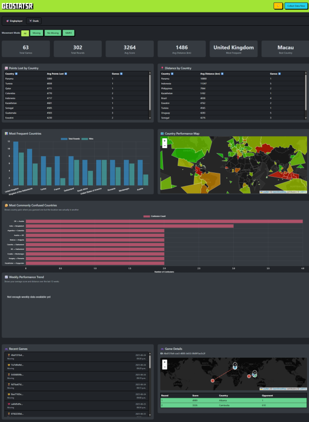

# GeoStatsr


A comprehensive statistics tracking tool for GeoGuessr that helps you analyze your gameplay, identify areas for improvement, and track your progress over time.



## What is GeoStatsr?

GeoStatsr is designed to help you keep track of your progress in GeoGuessr and identify areas where you need to improve. Rather than just looking at overall averages, GeoStatsr provides detailed breakdowns by country, movement type, and game mode to help you focus your learning efforts where they'll have the most impact.

For example, you might have a high average score in the US overall, but GeoStatsr could reveal that you frequently confuse Austria and Germany. With this insight, you can focus your time learning the distinguishing features between these countries rather than spending time on areas where you're already strong.

## Features

### Game Tracking
- **Standard Games**: Tracks singleplayer games with detailed round-by-round analysis
- **Duels**: Comprehensive tracking of multiplayer duels including health, opponent data, and match outcomes
- **Movement Detection**: Automatically categorizes games by movement type (Moving, NoMove, NMPZ)
- **Map Support**: Tracks which maps you've played and your performance on each

### Analytics & Statistics
- **Country-based Analysis**: See your performance breakdown by country
- **Movement Type Comparison**: Compare your performance across different movement restrictions
- **Timeline Analysis**: Track your improvement over time
- **Best/Worst Performance**: Identify your strongest and weakest countries
- **Distance Accuracy**: Precise distance calculations using the Haversine formula

### Web Interface
- **Dashboard**: Overview of your recent games and key statistics
- **Game History**: Detailed list of all tracked games with filtering options
- **Country Pages**: Deep-dive analysis for individual countries
- **Charts & Visualizations**: Interactive charts powered by Chart.js

### Streamer Features
- **OBS Integration**: Clean, overlay-friendly statistics pages perfect for streaming
- **Real-time Updates**: Statistics update automatically as you play
- **Customizable Display**: Multiple view options for different streaming needs

## Installation & Setup

### Prerequisites
- Go 1.23 or later
- Windows, macOS, or Linux

### Building from Source
```powershell
git clone https://github.com/teamcoltra/geostatsr.git
cd geostatsr
go build
```

### Running as a Service

GeoStatsr can be installed and run as a system service on Windows, macOS, and Linux. This allows it to run automatically in the background and start on boot.

#### Service Commands

The program supports the following service commands:

```bash
# Install the service (requires administrator/root privileges)
./geostatsr -s install

# Start the service
./geostatsr -s start

# Stop the service
./geostatsr -s stop

# Restart the service
./geostatsr -s restart

# Uninstall the service
./geostatsr -s uninstall
```

#### Platform-Specific Notes

**Windows:**
- Service commands require administrator privileges (run PowerShell/Command Prompt as Administrator)
- The service will be registered in Windows Services as "GeoStatsr"
- Service logs can be viewed in Windows Event Viewer

**Linux:**
- Service commands require root privileges (`sudo`)
- The service uses systemd on most modern distributions
- Service status: `sudo systemctl status GeoStatsr`
- Service logs: `sudo journalctl -u GeoStatsr`

**macOS:**
- Service commands require root privileges (`sudo`)
- The service uses launchd
- Service status: `sudo launchctl list | grep GeoStatsr`

#### Standalone Mode

If you prefer not to run as a service, you can run GeoStatsr in standalone mode:

```bash
# Run in standalone mode
./geostatsr

# Run with custom config file
./geostatsr -c /path/to/config.yaml
```

The program will automatically fall back to standalone mode if service installation is not possible or if the service framework is not available.

### Running GeoStatsr
```powershell
./geostatsr.exe
```

On first run, GeoStatsr will create a default configuration file in the directory it's run from. You can customize that directory. 

### Configuration

Edit the configuration file to set your preferences:

```yaml
# GeoStatsr Configuration File
# 
# ncfa: Your GeoGuessr NCFA cookie value (leave empty initially, update via API)
ncfa: ""

# Server settings
listen_ip: "0.0.0.0"   # IP to bind to (0.0.0.0 for all interfaces)
port: 62826            # Port to listen on

# Optional settings (uncomment to enable)
# debug: true                        # Enable debug logging
# log_directory: "/path/to/logs"     # Directory for log files when debug is enabled

# Security settings
is_public: false               # If true, requires private key for API updates
private_key: "auto-generated"  # Private key for API access (auto-generated)
```

### Getting Your NCFA Cookie

1. Open your browser's developer tools (F12)
2. Go to GeoGuessr and log in
3. Navigate to the Application/Storage tab
4. Find the `_ncfa` cookie under geoguessr.com
5. Copy the value and either:
   - Add it to your config file, or
   - Use the API endpoint: `http://localhost:62826/api/update_ncfa?token=YOUR_NCFA_VALUE`

## API Documentation

GeoStatsr provides a comprehensive REST API for programmatic access to your data.

### Authentication
If `is_public` is set to `true` in your config, API update endpoints require your private key:
```
POST /api/endpoint?key=YOUR_PRIVATE_KEY
```

### Configuration Endpoints

#### Update NCFA Cookie
```http
POST /api/update_ncfa?token=YOUR_NCFA_COOKIE
```
Updates your GeoGuessr authentication cookie.

### Data Collection Endpoints

#### Collect Games Now
```http
POST /api/collect_now
```
Triggers immediate collection of new games from your GeoGuessr feed.

### Statistics Endpoints

#### Summary Statistics
```http
GET /api/summary?type=standard|duels&move=Moving|NoMove|NMPZ
```
Returns aggregated statistics. All parameters are optional (defaults to all types/movements).

Response:
```json
{
  "totalGames": 150,
  "totalRounds": 750,
  "avgScore": 4250.5,
  "avgDistKm": 125.3,
  "favouriteCountry": "United States",
  "bestCountry": "Norway",
  "worstCountry": "Mongolia"
}
```

#### Game List
```http
GET /api/games?type=standard|duels&limit=30
```
Returns a list of recent games with basic information.

#### Individual Game Details
```http
GET /api/game?id=GAME_ID
```
Returns detailed round-by-round breakdown for a specific game.

#### Country Statistics
```http
GET /api/country?code=US&type=standard|duels&move=Moving|NoMove|NMPZ
```
Returns detailed statistics for a specific country.

#### Timeline Data
```http
GET /api/timeline?type=standard|duels&move=Moving|NoMove|NMPZ&days=30
```
Returns performance data over time for charting.

## OBS Integration for Streamers

GeoStatsr includes a customizable statistics overlay designed specifically for OBS Browser Sources that displays clean, readable statistics perfect for streaming.

### Stats Row Overlay

The `/stats_row` endpoint provides a horizontal row of statistics cards that you can customize through URL parameters.

**Base URL**: `http://localhost:62826/stats_row`

### Customization Options

You can customize the overlay using URL parameters:

#### Game Type & Filters
- `?type=standard` - Show singleplayer stats (default)
- `?type=duels` - Show duels stats
- `?move=Moving` - Filter by movement type (Moving, NoMove, NMPZ)
- `?timeline=7` - Show stats from last 7 days (or 30, 90, etc.)

#### Card Selection
Use the `cards` parameter to show only specific statistics:
- `?cards=avg_score,best_country` - Show only average score and best country
- `?cards=total_games,avg_score,avg_distance` - Show games, score, and distance

**Available Cards:**
- `total_games` - Total number of games played
- `total_rounds` - Total number of rounds played
- `avg_score` - Average score across all rounds
- `avg_distance` - Average distance error in kilometers
- `fav_country` - Most frequently played country
- `best_country` - Country with highest average score

### Example OBS URLs

#### Basic Setup (All Stats)
```
http://localhost:62826/stats_row
```

#### Recent Performance (Last 7 Days)
```
http://localhost:62826/stats_row?timeline=7
```

#### Compact Display (Score + Best Country Only)
```
http://localhost:62826/stats_row?cards=avg_score,best_country
```

#### Duels Stats with Movement Filter
```
http://localhost:62826/stats_row?type=duels&move=Moving
```

#### Custom Streamer Setup
```
http://localhost:62826/stats_row?type=standard&timeline=30&cards=avg_score,avg_distance,best_country
```

### OBS Setup Steps

1. **Add Browser Source**
   - In OBS, add a new "Browser Source"
   - Set URL to one of the examples above
   - Recommended width: 1200px (adjusts based on number of cards)
   - Recommended height: 140px

2. **Configure Browser Source**
   - Check "Refresh browser when scene becomes active"
   - Set "Shutdown source when not visible" if desired
   - No custom CSS needed - the overlay uses a dark theme by default

3. **Positioning**
   - The overlay automatically adjusts column widths based on visible cards
   - Works well as a bottom overlay or side panel
   - Cards are responsive and will stack on smaller widths

### Auto-Refresh

The stats overlay automatically refreshes every 30 seconds to show updated statistics as you play. No manual refresh needed!

## Architecture & Data Storage

### Database Schema
GeoStatsr uses SQLite for data storage with the following main tables:

- **games**: Game metadata (ID, type, movement, map, date)
- **rounds**: Individual round data (scores, coordinates, distances, countries)
- **user_metadata**: User profile information
- **br_rank**: Battle Royale ranking history
- **competition_medals**: Medal tracking
- **competitive_rank**: Competitive ranking data

### Country Detection
GeoStatsr uses a two-tier approach for country detection:
1. **Primary**: CountryCoder library for fast, accurate lookups
2. **Fallback**: GeoJSON polygon matching for edge cases

All coordinates are reverse-geocoded to ISO country codes for consistent analysis.

### Data Collection
- **Standard Games**: Uses GeoGuessr V3 API for detailed game data
- **Duels**: Currently web scrapes summary pages (V4 API migration planned)
- **Feed Monitoring**: Polls your private feed for new games
- **Deduplication**: Automatically prevents duplicate game storage

## Planned Features (TODO)

- [ ] Track game wins/losses for duels
- [ ] Switch to official Duels API (`https://game-server.geoguessr.com/api/duels/{gameId}`)
- [ ] Add team duels support
- [ ] Add challenge game tracking
- [ ] Fix sun/moon display timing
- [ ] Enhanced template engine with headers/footers
- [ ] Export functionality (CSV, JSON)
- [ ] Achievement system
- [ ] Performance comparison with friends
- [ ] Advanced filtering and search
- [ ] Browser Extension - Update the database at the end of every game, maybe other features? 
- [ ] Set custom template / static directory. Maybe just update the config flag to be a directory everything lives in instead of just the config file. 
- [ ] Competitive standings and week-over-week updates on performance (this is being stored in the database but not used yet)

## Contributing

Contributions are welcome! Please feel free to submit pull requests or open issues for bugs and feature requests.

## API Docs
I have another repo here https://github.com/teamcoltra/geoguessr-api-docs this is likely a good resource for finding other features to add. 

## License

[Add your license here]

## Support

If you encounter any issues or have questions:

1. Check the debug logs (enable `debug: true` in config)
2. Open an issue on GitHub

---

**Note**: This tool is not affiliated with GeoGuessr. Use responsibly and in accordance with GeoGuessr's terms of service.
