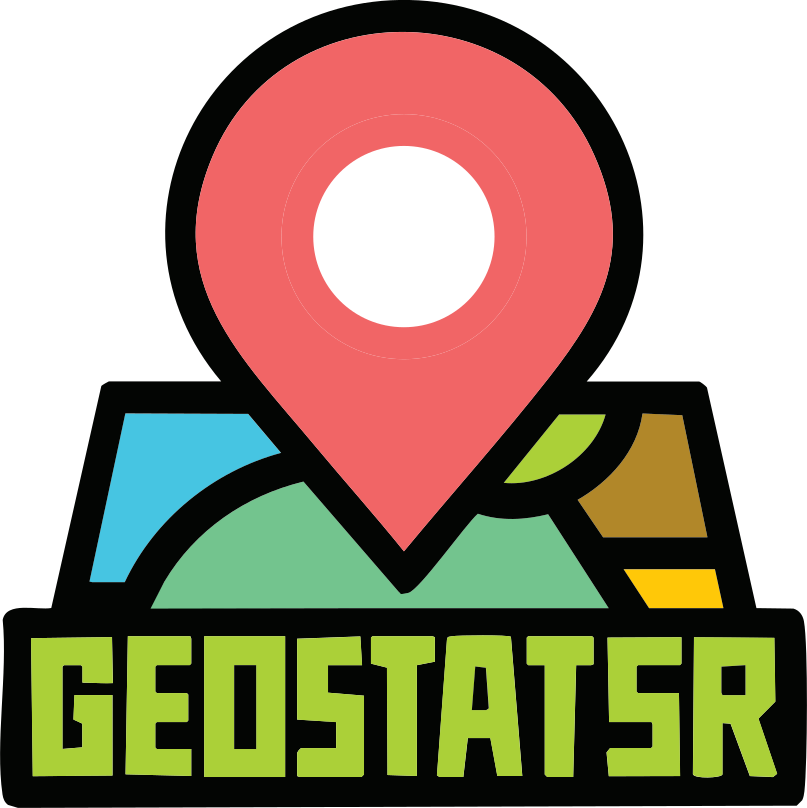

**GeoStatsr** is a comprehensive statistics tracker for [GeoGuessr](https://www.geoguessr.com), designed to help you analyze gameplay, identify weak spots, and track your improvement over time — with detailed breakdowns by country, movement type, and game mode.


---

## 🚀 Quick Start

### 🔽 Download and Install

1. **Download latest ZIP**  
   [Click here to download](https://github.com/teamcoltra/GeoStatsr/archive/refs/heads/main.zip)

2. **Unzip the folder**

3. **Run the installer** for your platform:
   - **Windows**: Right-click `windows-installer.bat` → “Run as Administrator”
   - **macOS**: Run `sudo ./mac-setup.sh` from terminal
   - **Linux**: Run `sudo ./linux-setup.sh` from terminal

> 💡 Installers automatically pick the correct binary for your architecture and set up GeoStatsr as a system service.

---

## 🛠 Developer Mode

Prefer to build from source?

```bash
git clone https://github.com/teamcoltra/GeoStatsr.git
cd GeoStatsr
go build
````

If you make **local changes**, you should disable automatic updates:

```bash
./geostatsr --auto-update false
```

---

## 🔍 What is GeoStatsr?

GeoStatsr is a local tool to track and analyze your GeoGuessr history, breaking down performance by country, movement mode, game type, and more.

Instead of vague averages, GeoStatsr shows **where you're actually struggling** — like constantly confusing Switzerland with Slovenia, even if your Europe average looks solid.

---

## 🎯 Features

### 🎮 Game Tracking

* Standard singleplayer games (detailed round breakdown)
* Duels (match results, health, opponent info)
* Movement detection (Moving / NoMove / NMPZ)
* Map tracking and performance analysis

### 📊 Analytics & Insights

* Country-based accuracy + performance scores
* Performance by movement type and game mode
* Historical timeline analysis and trend tracking
* Best/worst country identification
* Haversine-based precision distance stats

### 🌐 Web Interface

* Dashboard overview with recent games
* Game history with filters and round data
* Country pages with drill-down performance
* Visualized statistics using Chart.js

### 📺 Streamer Support

* OBS-friendly overlays
* Real-time stats updates
* Custom views for stream layout flexibility

---

## ⚙️ Installation Details

### Platforms Supported

* ✅ Windows (x64 & ARM64)
* ✅ macOS (Intel & Apple Silicon)
* ✅ Linux (x64 & ARM64)

### Requirements

* Go 1.23+ (for source builds)
* Admin/root access for service installation

---

## 🧩 Running GeoStatsr

Once installed, GeoStatsr runs as a background service.

To control it manually:

```bash
# Install the service
./geostatsr -s install

# Start or stop the service
./geostatsr -s start
./geostatsr -s stop

# Restart or uninstall
./geostatsr -s restart
./geostatsr -s uninstall
```

### 📦 Standalone Mode

Prefer running it directly?

```bash
./geostatsr             # Use default config
./geostatsr -c config.yaml   # Custom config file
```

GeoStatsr will auto-detect whether it can run as a service or fallback to standalone.

---

## 🧠 Configuration

On first run, GeoStatsr generates a default config file:

```yaml
ncfa: ""                     # Your GeoGuessr _ncfa cookie
listen_ip: "0.0.0.0"
port: 62826
is_public: false
private_key: "auto-generated"
# debug: true
# log_directory: "/path/to/logs"
```

---

## 🍪 Getting Your NCFA Cookie

1. Open your browser's dev tools (F12)
2. Go to [GeoGuessr](https://www.geoguessr.com) and log in
3. Find the `_ncfa` cookie under geoguessr.com > Storage
4. Add the value to your `config.yaml` or use this:

```http
GET /api/update_ncfa?token=YOUR_NCFA_VALUE
```

---

## 📡 API Reference

### Authentication (if `is_public: true`)

Use your private key with any `POST` update:

```http
POST /api/endpoint?key=YOUR_PRIVATE_KEY
```

### Key Endpoints

| Endpoint               | Description                           |
| ---------------------- | ------------------------------------- |
| `/api/update_ncfa`     | Update your GeoGuessr login cookie    |
| `/api/collect_now`     | Pull new game data from your feed     |
| `/api/summary`         | Aggregated stats by type and movement |
| `/api/games`           | List recent games                     |
| `/api/game?id=GAME_ID` | Full round-by-round breakdown         |
| `/api/country?code=US` | Country-specific performance data     |
| `/api/timeline`        | Performance over time                 |

---

## 📺 OBS Overlay Integration

Use `http://localhost:62826/stats_row` in a Browser Source in OBS.

### Examples:

```
# Default (all stats)
http://localhost:62826/stats_row

# Only show best country and score
http://localhost:62826/stats_row?cards=avg_score,best_country

# 7-day duel stats with NoMove
http://localhost:62826/stats_row?type=duels&move=NoMove&timeline=7
```

### Available Cards:

* `total_games`
* `total_rounds`
* `avg_score`
* `avg_distance`
* `fav_country`
* `best_country`

---

## 🗃 Architecture & Storage

* **SQLite** backend for all stats
* Reverse-geocoding by country using CountryCoder + GeoJSON fallback
* Game deduplication and daily polling
* API-driven + web scraping (for Duels)

Tables include:

* `games`, `rounds`, `user_metadata`
* `br_rank`, `competitive_rank`, `competition_medals`

---

## 📌 TODO

* [ ] Win/loss tracking for Duels
* [ ] Full Duels API support
* [ ] Team Duels and Challenges
* [ ] Export to CSV/JSON
* [ ] Advanced filtering & comparisons
* [ ] Friend leaderboard comparisons
* [ ] Standings and weekly trends
* [ ] Dynamic template/static folder via config
* [ ] Offload some of this README to Github Wiki

---

## 🤝 Contributing

Pull requests welcome! Open issues for bugs, features, or suggestions.

Also check:
**[GeoGuessr API Docs Repo](https://github.com/teamcoltra/geoguessr-api-docs)** for potential features to implement.

---

## 📜 License

**[Yo License](LICENSE)** – Use freely, modify freely.
If you meet me in person and like this tool, just say "yo." 😎

---

## 🧠 Final Notes

Yes, I include platform-specific **prebuilt binaries** directly in this repo.
Why?

* Most users **don’t build from source**
* This makes installation fast and easy
* No releases tab, no confusion — just unzip and run

If you disagree or want an alternate release flow, open an issue — I’m open to ideas.

> ⚠️ **GeoStatsr is not affiliated with GeoGuessr.** Use responsibly and in accordance with their [terms of service](https://www.geoguessr.com/terms).
